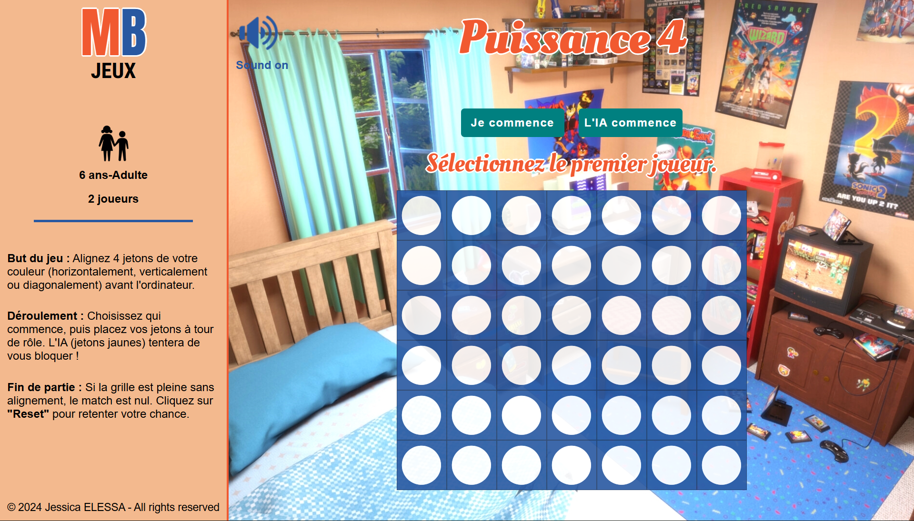

# connect4-react-functions

This project is a functional refactor of my previous 'Connect 4' game implementation.

## Table of Contents

- [Evolution & Migration](#evolution--migration)
- [Demo](#demo)
- [Stack](#stack)
- [Screenshot](#screenshot)
- [Main features](#main-features)
- [Game rules](#game-rules)
- [Musical credits](#musical-credits)
- [Run the project locally](#run-the-project-locally)
- [Getting started with Vite](#getting-started-with-vite)
- [Contributing](#contributing)
- [Stay Updated](#stay-updated)
- [Contact](#contact)

## Evolution & Migration

The goal was to migrate the entire codebase of my former project from **React Class Components** to **React Functional Components** using modern **Hooks** (`useState`, `useEffect`, `useRef`, `useCallback`).

> 🔗 **Original Class-based version :** [here](https://github.com/jesselessa/connect4-react-classes)

## Demo

> 🔗 [Clink on this link if you want to play the game.](https://www.connect4.jesselessa.dev)

## Stack

This project was built using **React** and **Vite**.

Unlike the legacy version, this repository follows modern React standards :

- **Functional Components** : For cleaner and more maintainable code.
- **React Hooks** : Efficient state management and lifecycle handling.
- **Vite** : For a lightning-fast development environment.

## Screenshot

## Main features

- **PvE Mode** : Play against an AI opponent with automated decision-making.
- **Dynamic Token Animation** : Realistic "drop" effect where tokens fall from the top of the grid to their position.
- **Visual Feedback** : The winning combination is highlighted with a pulse animation to clearly identify the end of the game.
- **Immersive Sound Effects** : Specific sounds for token drops, victory, defeat, and draw games.
- **Responsive Design** : The game board and UI adapt perfectly to mobile, tablet and desktop screens.
- **Game State Management** : Automatic detection of turns, victories, and stalemates with an easy reset option.
- **Background Music** : Integrated audio toggle for an enhanced gaming atmosphere.

## Game Rules

Challenge our computer opponent in this classic strategy game ! Here is how it works :

- **Man vs Machine** : This project is designed as a single-player experience where you face off against an AI.
- **Choose the Starter** : You decide who takes the first shot ! Select either "Player" or "AI" to start the game.
- **Your Colors** :
  - **You** : Play with the **Red** tokens.
  - **AI** : Plays with the **Yellow** tokens.
- **The Drop** : On your turn, click on any column to drop your token. The token will realistically fall to the lowest available space in that column.
- **The Objective** : Be the first to align **four** of your tokens in a row (horizontally, vertically or diagonally).
- **Winning & Draw** :
  - **Victory** : If you align four tokens, they will **highlight and pulse** with a victory sound.
  - **Defeat** : If the AI beats you, a failure sound will play.
  - **Stalemate** : If the grid is full with no winner, the game ends in a draw.
- **Restarting** : Use the **'Reset'** button at any time to clear the board and try a new strategy against the computer.

## Musical credits

Licence : Pixabay Content License (Free Use)

- **Background Music** : ['80's Music - Electric Dreams 2.0' by Tech_Oasis](https://pixabay.com/fr/music/synthwave-80x27s-music-electric-dreams-20-211957/)
- **Token Drop Sound** : ['Coin Bag Pickup Drop' by ralph.whitehead](https://pixabay.com/fr/sound-effects/films-et-effets-sp%c3%a9ciaux-coin-bag-pickup-drop-94617/)
- **Victory Sound** : ['Winning' by PW23CHECK](https://pixabay.com/fr/sound-effects/winning-218995/)
- **Game Over / Defeat Sound** : ['Failure 1' by Leszek_Szary](https://pixabay.com/fr/sound-effects/failure-1-89170/)
- **Stalemate Sound** : ['Short Mission Accomplished' (Pixabay)](https://pixabay.com/fr/sound-effects/)

## Run the project locally

1. Open your terminal and navigate to the location where you want the local repository to be copied.
2. Clone the repository : `git clone https://github.com/jesselessa/connect4-react.git`
3. Navigate to the project directory : `cd connect4-react`
4. Install dependencies : `npm install`
5. Run the application in development mode : `npm run dev`
6. Open `http://localhost:5173` in your browser.

## Getting Started with Vite

[Vite](https://vitejs.dev/) is a fast development tool for modern web applications.

### 1. Install Node.js and npm

Ensure you have Node.js and npm installed. Download them from the [official Node.js website](https://nodejs.org/en).

### 2. Install dependencies

Run `npm install` to install all necessary packages.

### 3. Start the development server

Use the command `npm run dev`. This will launch Vite at `http://localhost:5173`.

### 4. Deploy to production

To build an optimized version, use `npm run build`. This generates a production-ready version in the `dist` directory.

## Contributing

- Explore the project structure in the `src` folder.
- Feel free to make improvements, fix bugs, or suggest new features via Pull Requests.

## Stay updated

To stay updated with the latest changes: `git pull origin main`

## Contact

For inquiries, contact me via [LinkedIn](https://www.linkedin.com/in/jesselessa/).

---

&copy; 2026, Jessica ELESSA - All rights reserved
